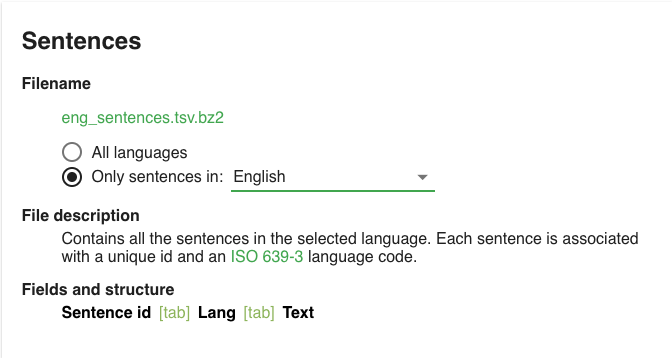
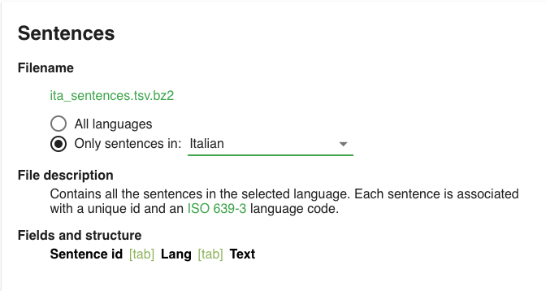
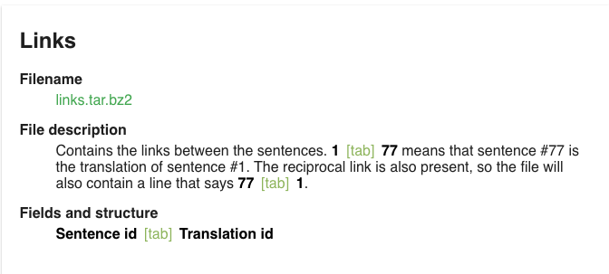

# TatoebaToAnki

tl;dr Create [Anki](https://ankiweb.net) cards via [Tatoeba](https://tatoeba.org/) translations.

#### What is [Anki](https://ankiweb.net)?

> ```textile
> Anki is a program which makes remembering things easy.
> Because it's a lot more efficient than traditional study methods,
> you can either greatly decrease your time spent studying,
> or greatly increase the amount you learn.
> ```

#### What is [Tatoeba](https://tatoeba.org/)?

Tatoeba is an online database that contains **A LOT** of user contributed phrases in many (if not all) languages.

#### How it works?

Assuming you know English and you want to learn Italian via this method you can go to [this link from tatoeba](https://tatoeba.org/eng/downloads) and, in the section _**Sentences**_, click on _**Only sentences in:**_ and select the language you know (in this example English), now click on the file name in green to download the sentence pack.



After that download the sentence pack of the language you want to learn (in this example Italian)



Now scroll down tho the _**Links**_ Section and download that file (it may be heavy)



Now you should export the compressed archives you just downloaded

-   On mac: double click on the archive

-   On windows: use [7zip](https://www.7-zip.org/download.html) or [winrar](https://www.win-rar.com/download.html)

-   On linux: you should know.

If you have not already downloaded this repo, download and extract it.

##### We are almost there!

Move the extracted language and links files in the repo folder then execute the command `npm install`, after that you can finally run the script via the command `node script.js eng_sentences.tsv links.csv ita_sentences.tsv`

Now you can import in Anki the compiled card set!

## FIN.
